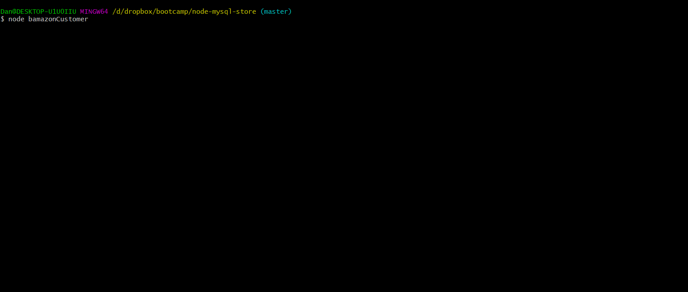
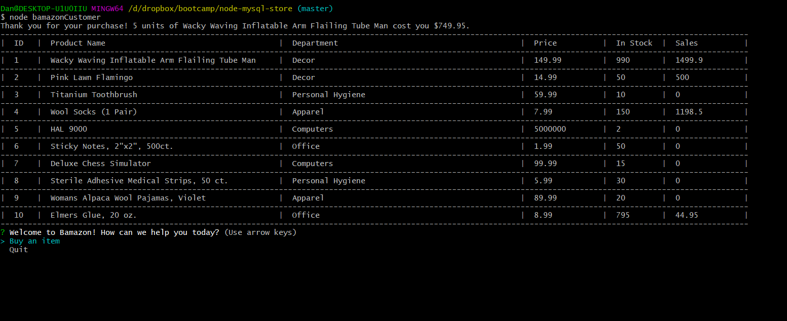
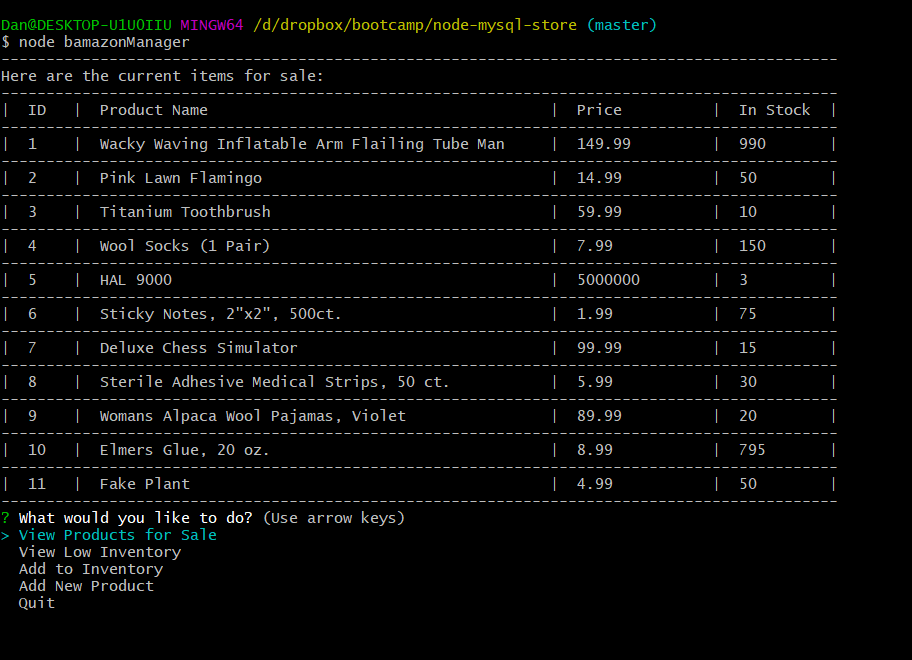
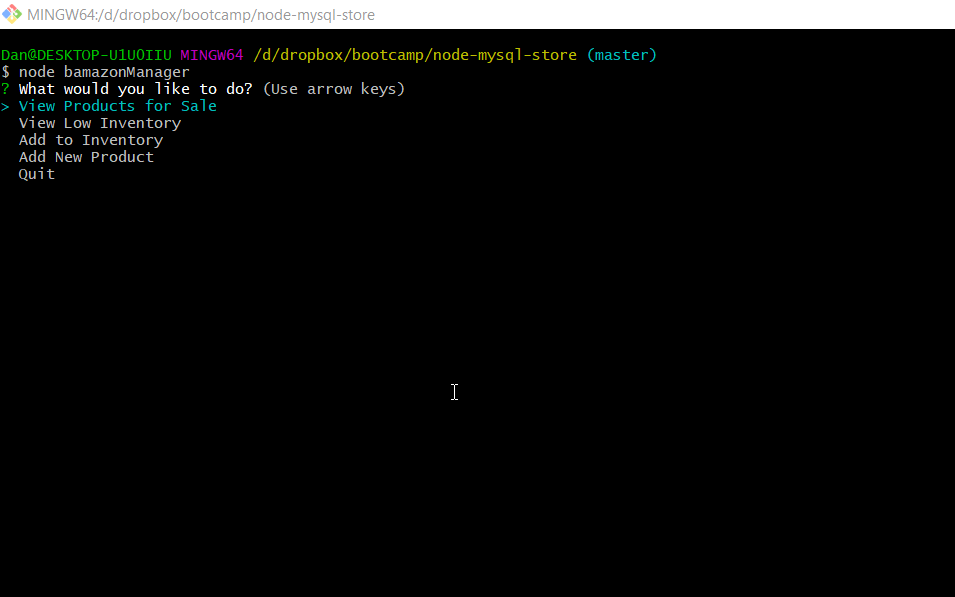
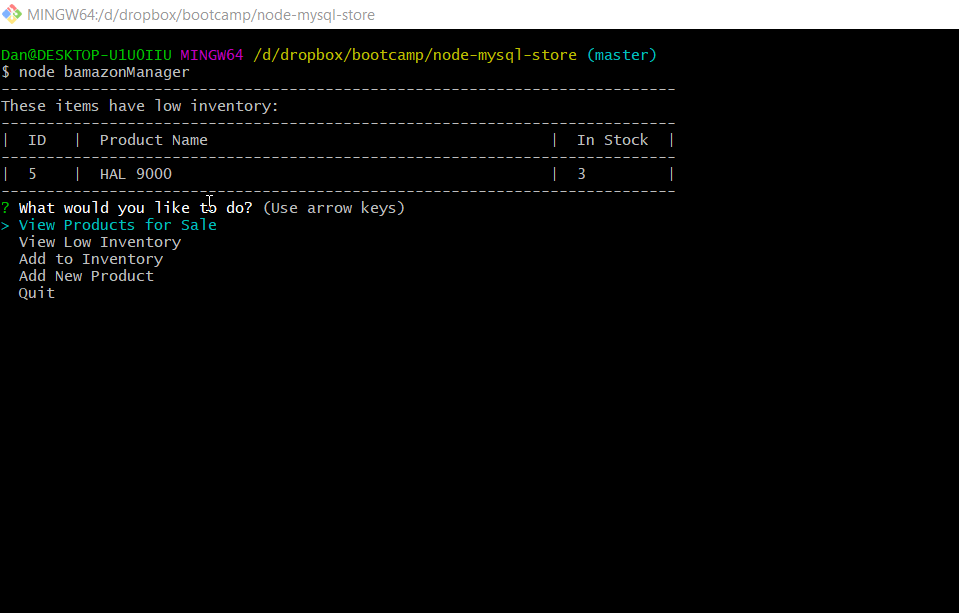
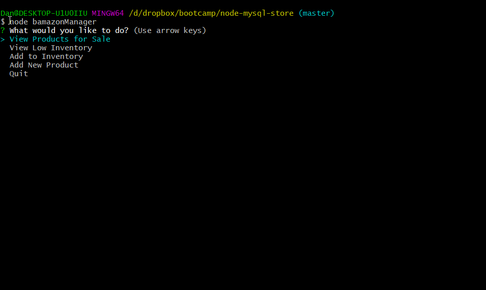
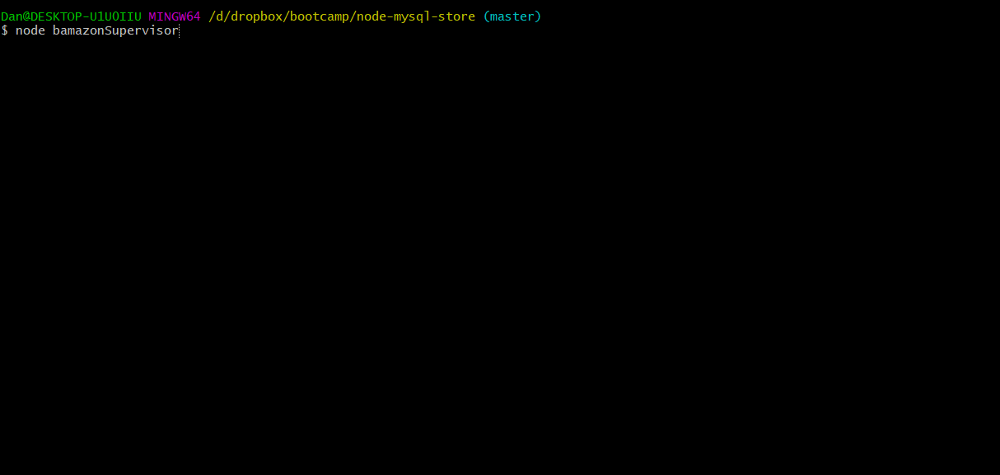
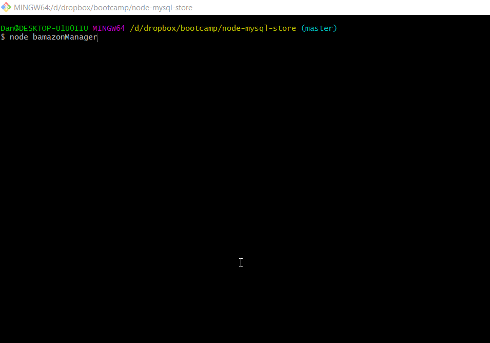
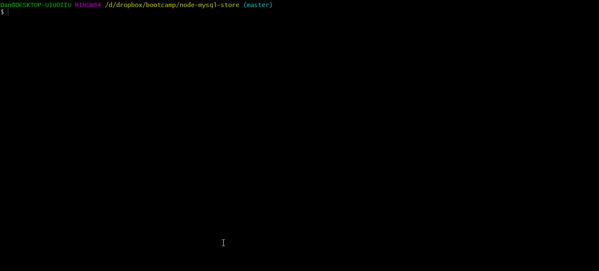
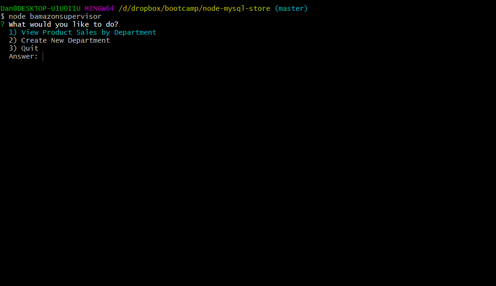

# Bamazon CLI
Welcome to Bamazon, a CLI storefront to interact with Bamazon, the much less known and less sleek web store!

This repo supports three different views to interact with Bamazon:

1. Customer View
2. Manager View
3. Supervisor View
---
## Prerequisites
In order to use Bamazon, ensure the following:
1. Clone the directory and ensure you have installed [the latest LTS of nodeJS](https://nodejs.org/)
2. From the installed directory, run: `npm install` to get the required dependencies, or manually install:
    - [Inquirer](https://www.npmjs.com/package/inquirer) using `npm install inquirer`
    - [mysql](https://www.npmjs.com/package/mysql) using `npm install mysql`
    - [dotenv](https://www.npmjs.com/package/dotenv) using `npm install dotenv`
3. Install [mySQL community Server](https://dev.mysql.com/downloads/windows/installer/8.0.html) and start a server instance
4. Run [the included .sql squema](./intialize_bamazon_DB.sql) to seed the server with the initial products.
5. Ensure to modify [myConnection.js](./myConnection.js) to reflect the host name and port from your instance of Bamazon
6. In the root directory, ensure to create a .env file, and add the following information:
    ```
    ## Sever Connection
    SERVER_USER = 'your_mysql_user_name_here'
    SERVER_SECRET = 'your_mysql_password_here'
    ```
---
# Using Bamazon

## __Customer View__

From the command line, run type ``node bamazonCustomer.js``

The user will be presented with a table of the currently available products for purchase from Bamazon, and prompted to buy an item or exit
| Operation | Result |
| :-----:   | :---:  |
|Purchase||
|Invalid Product ID| |

---

## __Manager View__
From the command line, run type ``node bamazonManager.js``

The user is presented with the following options:

| Operation | Result |
| :-----:   | :---:  |
|View Products for Sale||
|View Low Inventory| |
|Add to existing product| |
|Add new product (from existing departments) | |

---

## __Supervisor View__
From the command line, run type ``node bamazonSupervisor.js``

The user is presented with the following options:

| Operation | Result |
| :-----:   | :---:  |
|View Departments||
|Add new department| |
| Demo |    |
